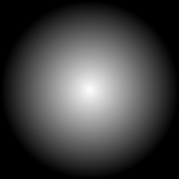

# 3D Driving Game with Babylon.js

A web-based 3D driving game prototype built with Babylon.js featuring realistic vehicle physics, ray-traced lighting effects, and a massive map with city, highway, and countryside areas.



## Features

- **Realistic Vehicle Physics**: Experience realistic driving mechanics with suspension, steering, and terrain interaction
- **Diverse Environment**: Explore a large map with distinct city, highway, and countryside areas
- **Advanced Lighting**: PBR materials and ray-traced lighting effects for realistic visuals
- **Multiple Camera Views**: Switch between follow camera, chase camera, and first-person view
- **Interactive UI**: Speedometer, minimap, position tracking, and driving metrics
- **Responsive Controls**: Intuitive keyboard controls for driving and camera manipulation

## Installation and Running

### Prerequisites
- A modern web browser with WebGL support (Chrome, Firefox, Edge, Safari)
- Local web server (optional, for development)

### Running the Game
1. Clone this repository:
   ```
   git clone https://github.com/yourusername/3d-driving-game.git
   ```

2. Navigate to the project directory:
   ```
   cd 3d-driving-game
   ```

3. Open `project/final/index.html` in your web browser
   - For local development, you can use a simple HTTP server:
     ```
     python -m http.server
     ```
     Then navigate to `http://localhost:8000/project/final/`

## Controls

- **W / Up Arrow**: Accelerate
- **S / Down Arrow**: Reverse
- **A / Left Arrow**: Turn Left
- **D / Right Arrow**: Turn Right
- **Space**: Brake
- **Shift**: Handbrake
- **C**: Change Camera View
- **R**: Reset Vehicle Position
- **H**: Toggle Help Panel

## Game Interface

- **Speedometer**: Shows your current speed in km/h
- **Gear Indicator**: Shows current gear (D: Drive, R: Reverse, N: Neutral)
- **Minimap**: Displays your position on the map with terrain indicators
- **Position Display**: Shows your current coordinates and terrain type
- **Camera Mode Indicator**: Shows your current camera view mode

## Technologies Used

- **Babylon.js**: 3D rendering engine
- **Havok Physics**: Physics engine for realistic vehicle simulation
- **WebGL**: Hardware-accelerated graphics rendering
- **JavaScript**: Core programming language
- **HTML5/CSS3**: Structure and styling

## Project Structure

```
project/
├── final/                      # Final game prototype
│   ├── index.html              # Main HTML file
│   ├── css/                    # Stylesheets
│   │   └── style.css           # Main CSS file
│   ├── js/                     # JavaScript files
│   │   ├── main.js             # Main game initialization
│   │   ├── vehicle.js          # Vehicle controls and physics
│   │   ├── environment.js      # Environment and map creation
│   │   ├── ui.js               # UI elements including minimap
│   │   └── lighting.js         # Lighting and effects
│   ├── models/                 # 3D models
│   │   └── vehicles/           # Vehicle models
│   └── textures/               # Texture files
```

## Performance Considerations

- The game automatically adjusts graphics settings based on your device capabilities
- For best performance:
  - Close unnecessary browser tabs and applications
  - Use a dedicated graphics card if available
  - Update your browser to the latest version

## Future Development Possibilities

- **Additional Vehicles**: More vehicle types with different handling characteristics
- **Day/Night Cycle**: Dynamic lighting changes based on time of day
- **Weather Effects**: Rain, snow, and fog with realistic physics impact
- **Traffic System**: AI-controlled vehicles and pedestrians
- **Missions and Objectives**: Structured gameplay with goals and rewards
- **Multiplayer Support**: Race or explore with friends in real-time
- **Mobile Support**: Touch controls for mobile devices
- **Vehicle Customization**: Modify appearance and performance

## Credits

- Vehicle model: ToyCar.glb (see models/vehicles/ToyCar_LICENSE.md for attribution)
- Babylon.js team for their excellent 3D engine
- Environment textures and skybox

## License

This project is licensed under the MIT License - see the LICENSE file for details.